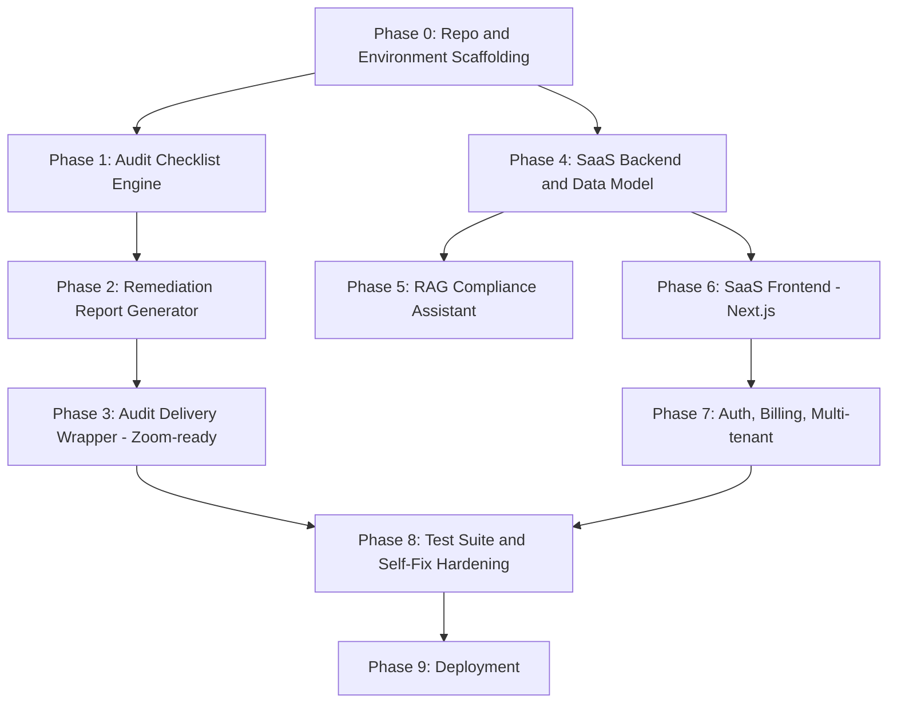

# ComplianceShield — Master Build Playbook (Claude Code)

**Owner:** Hunter
**Combined entity:** ComplianceShield (audit service) + former FailSafe360 (SaaS platform), merged
**Status:** Pre-revenue. Zero clients. This playbook sequences the build — it does not substitute for market contact.
**Notion tracker:** ComplianceShield Command Center → Claude Code Build Tracker (10 phases, kept in sync manually or via Notion MCP if connected in Claude Code)

---

## 0. How to Use This File

1. Place this file at the root of the project repository.
2. Open Claude Code in that repository.
3. Paste the **Master Kickoff Prompt** (Section 2) as your first message.
4. Claude Code works one phase at a time, in dependency order (Section 1's graph), running that phase's **Self-Fix Loop Prompt** (Section 4) until the Definition of Done is met — then stops and reports back before starting the next phase. It does not skip ahead.
5. After each phase, update the matching row in the Notion **Claude Code Build Tracker**: Status → Done, check Self-Fix Loop Used, log deviations in Notes.
6. If Claude Code gets stuck in a loop (3 failed self-fix attempts on the same issue), it must stop and surface the blocker to you rather than attempting a 4th fix. Do not let it thrash.

---

## 0.5 Required Inputs Before Starting

Two of these are **blocking** — Claude Code should not begin Phase 1 (or later) without them, because guessing on either produces a compliance liability rather than an ordinary bug. The rest have sensible defaults Claude Code may use, but should flag as assumptions in its phase reports rather than deciding silently.

### Blocking — do not proceed to Phase 1 without these

| Input | What's needed | Where it should come from |
|---|---|---|
| **Checklist source content** | The actual 80-120 yes/no compliance questions across the 6 regulatory domains, or the source knowledge base to derive them from | Export the Notion **Compliance Knowledge Base** database to a file (e.g. `knowledge-base-export.md` or `.csv`) and place it in `/shared` before starting Phase 1. Claude Code must build the checklist from this file, not from its own training-data knowledge of OSHA/DBPR/EPA rules. If the file is missing or incomplete for a domain, Claude Code should stop and report which domain is missing rather than filling the gap from memory. |
| **Legal disclaimer text** | Exact "not legal advice" / liability-limiting language to embed in every client-facing report and the SaaS platform's output | Hunter to supply, ideally reviewed by an attorney before Phase 2 ships anything to a real client. Until supplied, Claude Code should use the placeholder disclaimer in Section 6 below and mark every report template with a visible `[PLACEHOLDER — ATTORNEY REVIEW REQUIRED]` tag so it can never accidentally ship un-reviewed. |

### Non-blocking — Claude Code may default, but must flag the assumption

| Input | Default if not supplied | Decide by |
|---|---|---|
| **Repo continuation** | Reuse `failsafe360-prototype.html` and the existing landing page as the Phase 6 frontend baseline rather than rebuilding from scratch (see Phase 6 spec, updated below) | Before Phase 6 |
| **Domain / email** | Placeholder `compliance-shield.com` / `hello@compliance-shield.com`, flagged for Hunter to replace with the real registered domain | Before Phase 9 |
| **Hosting target** | Vercel (frontend) + Render (backend + Postgres) as a reasonable low-maintenance default for a solo founder | Before Phase 9 |
| **Auth provider** | Roll-your-own JWT-based auth rather than a paid provider, to avoid adding a recurring cost pre-revenue | Before Phase 7 |
| **Anthropic API budget for RAG pipeline** | No hard ceiling enforced; Claude Code should log estimated token/cost usage in its Phase 5 report so Hunter can set a ceiling with real numbers in hand | Before Phase 5 goes to production traffic |

---

## 1. Phase Dependency Graph

Sequencing matters. The Service track (audit tooling) is deliberately front-loaded because it reaches revenue fastest and generates the real workflow data the SaaS platform should be built around. The SaaS track does not start its client-facing frontend until the backend data model exists.



**Reading this graph:** Phase 3 (service, revenue-capable) and Phase 7 (SaaS platform, feature-complete) are independent tracks that both feed into Phase 8. The service track can go to market as soon as Phase 3 is done — it does not need to wait on the SaaS track. Do not let SaaS platform work block or delay shipping the audit service.

---

## 2. Master Kickoff Prompt

Paste this into Claude Code as the first message in a fresh session:

```
You are building ComplianceShield, a combined audit-service-plus-SaaS-platform
product, from a written playbook at PLAYBOOK.md in this repo root.

Read PLAYBOOK.md in full before doing anything else.

Before starting Phase 1 (Phase 0 itself has no blocking inputs), check for
the two blocking inputs listed in Section 0.5: a checklist source content
file under /shared, and a legal disclaimer text. If either is missing, use
the documented fallback (placeholder disclaimer, tagged for attorney
review) or stop and report exactly what's missing — do not invent
regulatory checklist content from your own training data under any
circumstance.

Rules:
1. Work through phases in the exact dependency order defined in Section 1's
   graph. Do not start a phase whose dependencies are not marked Done.
2. For each phase, read its spec in Section 3, then run the Self-Fix Loop
   Prompt template from Section 4, substituting in that phase's objective,
   tasks, and Definition of Done.
3. A phase is only complete when its Definition of Done is fully met and
   verified — not when code merely exists. Write and run tests where the
   phase spec calls for them.
4. After completing a phase, output a short status report: what was built,
   what was tested, what the Definition of Done check showed, and any
   deviations from the spec and why.
5. If you fail the same check 3 times in the self-fix loop, STOP. Do not
   attempt a 4th fix. Report the blocker, what you tried, and what
   information or decision you need from me.
6. Do not start Phase 4 or later (SaaS platform track) work if Phase 0-3
   (service track) is not done, unless I explicitly tell you to reprioritize.
   The service track is the revenue-critical path.
7. Confirm with me before: deleting any file outside files you created this
   session, adding a paid third-party API dependency, or making any
   architecture decision not already specified in the phase spec.

Start with Phase 0. Report back when its Definition of Done is met.
```

---

## 3. Phase Specifications

### Phase 0 — Repo and Environment Scaffolding
**Track:** Shared/Infra
**Depends on:** None

**Tasks:**
- Initialize monorepo structure: `/service` (audit tooling), `/platform` (SaaS backend + frontend), `/shared` (knowledge base, common types)
- `README.md` describing the repo layout and how the two tracks relate
- `.env.example` templating every environment variable both tracks will eventually need
- Git initialized with `main` and `dev` branches, `.gitignore` appropriate to the stack

**Definition of Done:** Repo scaffolded, README explains the split, environment variables templated, both branches exist.

---

### Phase 1 — Audit Checklist Engine
**Track:** Service
**Depends on:** Phase 0

**Tasks:**
- Source every checklist question from `/shared/knowledge-base-export.md` (or equivalent exported file per Section 0.5) — do not generate regulatory checklist items from training-data knowledge of OSHA/DBPR/EPA rules. If a domain is missing or thin in the export, stop and report which domain, rather than filling the gap
- Implement the 6-domain checklist as structured data (JSON or equivalent): OSHA (29 CFR 1926), DBPR/CILB licensing, workers' compensation, EPA/environmental (RRP, NPDES, NESHAP), Florida Building Code/HVHZ, employment and tax compliance
- Target 80-120 yes/no questions total across domains, weighted by risk severity
- Scoring logic: per-domain pass/at-risk/fail output plus an overall risk score
- Unit tests covering scoring edge cases (all-pass, all-fail, mixed)

**Definition of Done:** Checklist data structure complete, scoring logic implemented and tested, produces a correct pass/at-risk/fail verdict per domain on sample input.

---

### Phase 2 — Remediation Report Generator
**Track:** Service
**Depends on:** Phase 1

**Tasks:**
- Given checklist results, generate a client-facing report (PDF or clean HTML) listing: findings by domain, risk level, specific remediation steps per failed item
- Every report must include the legal disclaimer text from Section 0.5, visibly placed (header or footer, not buried). If only the placeholder is available, the `[PLACEHOLDER — ATTORNEY REVIEW REQUIRED]` tag must render on the report itself, not just in code comments — this must be impossible for Hunter to miss or accidentally ship
- Report should be usable as the actual deliverable for a paid audit, not just an internal debug dump
- Template should be reusable across the three pricing tiers (Essentials covers 3 domains, Complete covers all 6)

**Definition of Done:** Given a sample checklist result, produces a complete, professional, client-ready report matching the correct tier scope, with the disclaimer (or clearly-flagged placeholder) visibly present.

---

### Phase 3 — Audit Delivery Wrapper (Zoom-call ready)
**Track:** Service
**Depends on:** Phase 2

**Tasks:**
- Build the thinnest possible interface (CLI or single local web form) that lets a non-technical operator run through the checklist live on a call and generate the report in real time
- No login system, no multi-user support — this is a single-operator tool
- Should run locally with a single command

**Definition of Done:** Hunter can run one command, answer the checklist questions live, and produce a finished remediation report before the call ends. This is the phase that makes the service sellable — it is the priority deliverable of this entire playbook.

---

### Phase 4 — SaaS Backend and Data Model
**Track:** SaaS Platform
**Depends on:** Phase 0

**Tasks:**
- FastAPI backend, running locally
- PostgreSQL schema: clients, audits, tasks, evidence, reports (mirrors the FailSafe360 prototype's five screens: Dashboard, Quick Audit, Tasks, Evidence, Reports)
- Migrations set up and reproducible

**Definition of Done:** Backend runs locally, schema is migrated cleanly from empty, basic CRUD on each entity is tested and working.

---

### Phase 5 — RAG Compliance Assistant
**Track:** SaaS Platform
**Depends on:** Phase 4

**Tasks:**
- PostgreSQL + pgvector store populated with the 6-domain knowledge base built during ComplianceShield's Phase 1 self-education sprint
- Retrieval-Augmented Generation (RAG) pipeline on the Claude API, exposed as a Q&A endpoint
- Answers must cite which regulation/section they're drawing from, not just assert facts

**Definition of Done:** Endpoint answers a set of test compliance questions (write at least 15 covering all 6 domains) with correct, cited answers verified against the source knowledge base.

---

### Phase 6 — SaaS Frontend (Next.js)
**Track:** SaaS Platform
**Depends on:** Phase 4

**Tasks:**
- Start from the existing `failsafe360-prototype.html` and landing page as the baseline unless Hunter specifies a clean rebuild — port its five screens (Dashboard, Quick Audit, Tasks, Evidence, Reports) forward rather than rebuilding from zero
- Dashboard, Task tracker, Evidence upload, Report view — functional against the live Phase 4 backend
- Any client-facing screen that surfaces compliance findings must carry the same disclaimer requirement as Phase 2's reports

**Definition of Done:** All four screens work end-to-end against live data, not mock data, using the existing prototype as the visual/UX baseline, with the disclaimer visible wherever compliance findings are shown.

---

### Phase 7 — Auth, Billing, Multi-tenant
**Track:** SaaS Platform
**Depends on:** Phase 6

**Tasks:**
- Client login/auth
- Multi-tenant data isolation — verify one client cannot see another's data
- Billing integration (Stripe or equivalent) wired to the Quarterly tier ($3,000/year) as the first billable SaaS product

**Definition of Done:** A test client can sign up, log in, see only their own data, and complete a test billing transaction in sandbox mode.

---

### Phase 8 — Test Suite and Self-Fix Loop Hardening
**Track:** Shared/Infra
**Depends on:** Phase 3, Phase 7

**Tasks:**
- Full automated test suite across both tracks: checklist logic, report generation, API endpoints, auth/isolation
- Run the self-fix loop (Section 4) against the full suite until 3 consecutive clean runs with no regressions

**Definition of Done:** Test suite passes 3 consecutive times with no manual intervention.

---

### Phase 9 — Deployment
**Track:** Shared/Infra
**Depends on:** Phase 8

**Tasks:**
- Deploy backend and frontend to production hosting
- Deploy/finish the landing page (fix the placeholder Calendly link, verify the `hunter@failsafe360.com`-style contact addresses are live and correct before anything goes out — rename to a ComplianceShield domain)
- Confirm a first real client could be onboarded end-to-end today

**Definition of Done:** Production URLs live, a full dry-run onboarding (fake client) completes with no errors.

---

## 4. Self-Fix Loop Prompt Template

Use this loop for every phase. This is the mechanism that lets Claude Code build, verify, and correct itself without you manually reviewing every intermediate step.

```
PHASE: {phase_name}
OBJECTIVE: {objective from Section 3}
TASKS: {tasks from Section 3}
DEFINITION OF DONE: {definition of done from Section 3}

Loop (max 3 iterations):

1. IMPLEMENT
   Build toward the Definition of Done. Write tests where the phase spec
   calls for them.

2. VERIFY
   Run the tests / manually exercise the feature against the Definition
   of Done, item by item. Do not mark anything done on assumption —
   actually run it.

3. DIAGNOSE
   If verification fails: identify the specific, smallest cause of the
   failure. Do not guess broadly or rewrite large sections speculatively.

4. FIX
   Apply the smallest fix that addresses the diagnosed cause.

5. RE-VERIFY
   Return to step 2.

Exit conditions:
- SUCCESS: Definition of Done fully verified. Report what was built, how
  it was verified, and stop. Await instruction to proceed to the next
  phase in the dependency graph.
- STOPPED: 3 iterations completed without meeting the Definition of Done.
  Do not attempt a 4th. Report: what was tried each iteration, what the
  verification showed each time, your best diagnosis of the remaining
  gap, and what decision or information you need from Hunter to proceed.
```

---

## 5. Notion Sync Instructions

The Claude Code Build Tracker database lives in Notion under the ComplianceShield Command Center page. Two options:

- **If the Notion MCP connector is available inside your Claude Code environment:** update the matching phase row's Status, Self-Fix Loop Used, and Notes directly after each phase completes.
- **If not connected:** Claude Code should append a line to a local `BUILD_LOG.md` in the repo root after each phase (`Phase N: Done — <one-line summary> — <date>`), and Hunter updates Notion manually from that log during the Sunday Weekly Review.

Either way, do not mark a phase Done in Notion until its Definition of Done has actually been verified per the self-fix loop's exit condition — the tracker should reflect real state, not intent.

---

## 6. Placeholder Disclaimer Text

Use this only until Hunter supplies attorney-reviewed language. It must render visibly on every report and every client-facing compliance screen, tagged exactly as shown:

```
[PLACEHOLDER — ATTORNEY REVIEW REQUIRED]
This report is provided for informational purposes to assist with internal
compliance review. It does not constitute legal advice, and does not
guarantee compliance with any federal, state, or local law or regulation.
Consult a licensed attorney or the relevant regulatory authority before
making compliance decisions based on this report.
```

---

## 7. Non-Negotiables (carried forward from strategy discussion)

- The Service track (Phases 1-3) is the revenue-critical path. It does not wait on the SaaS Platform track.
- Stay Florida-specific and construction/skilled-trades-only until the first paid client. Do not let Phase 4-7 quietly reintroduce the HIPAA/medical-clinic vertical from the old FailSafe360 scope.
- One brand: ComplianceShield. Any lingering references to FailSafe360 (email addresses, domain names, footer text) get corrected during Phase 9, not left in place.
- Do not begin the seven-agent orchestration system mentioned in prior planning. That remains gated behind 5 free audits and 3 paid clients, per the existing risk register — this playbook does not unlock it early.
